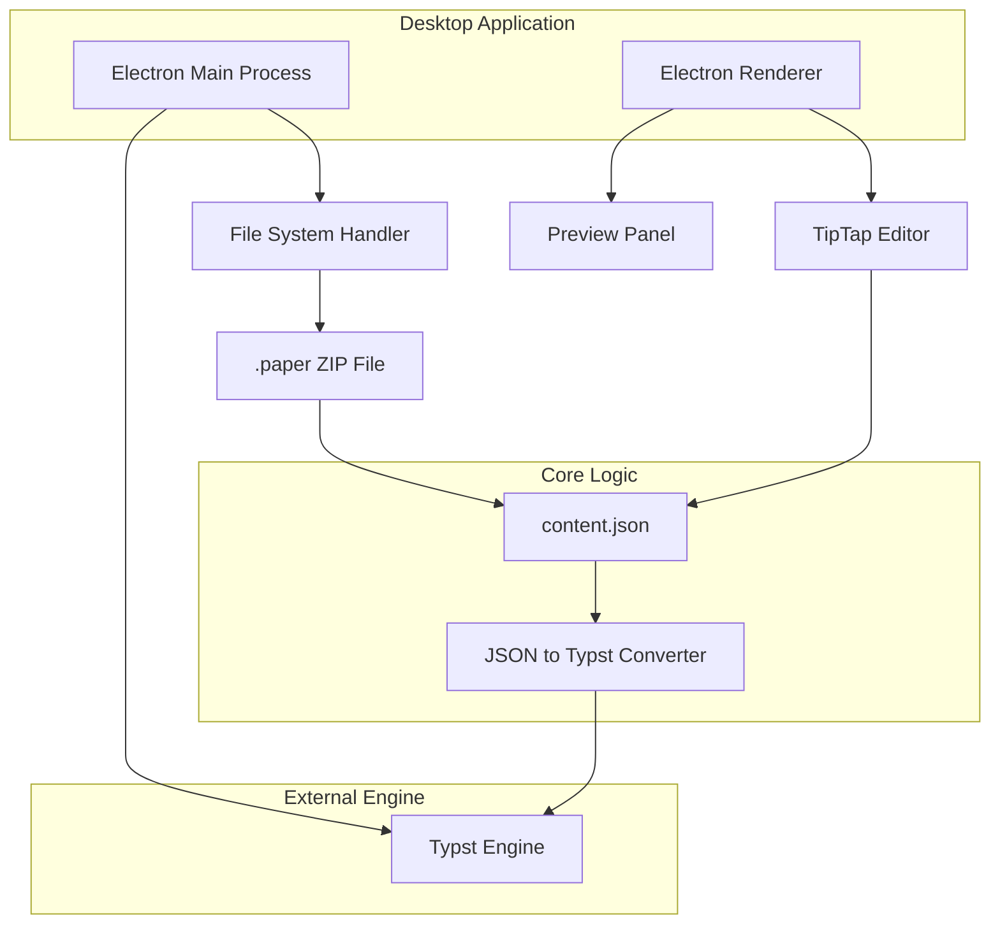
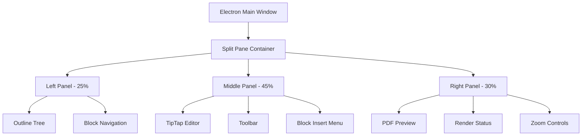

## 1. 架构设计



## 2. 技术描述

* 桌面框架: Electron\@27 + Node.js\@18

* 编辑器: TipTap\@2 (基于 ProseMirror) + Vue\@3

* 排版引擎: Typst (本地二进制调用)

* 文件处理: adm-zip\@0.5

* 初始化工具: electron-vite

## 3. 核心模块定义

### 3.1 content.json 数据结构

```typescript
interface PaperData {
  version: string;
  paper_info: {
    title: string;
    author: string;
    school: string;
  };
  body: Block[];
  references: Reference[];
}

interface Block {
  id: string;
  type: 'heading' | 'paragraph' | 'image' | 'citation';
  content?: string;
  attrs?: {
    level?: number;      // heading level
    src?: string;        // image source
    caption?: string;    // image caption
    refId?: string;      // citation reference
  };
}

interface Reference {
  id: string;
  title: string;
  author: string;
  year: number;
}
```

### 3.2 文件处理API

| API                       | 用途                               |
| ------------------------- | -------------------------------- |
| loadPaper(filePath)       | 加载.paper文件并解压读取content.json      |
| savePaper(filePath, data) | 将content.json和资源打包为.paper文件      |
| exportPDF(data)           | 将content.json转换为.typ文件并调用Typst渲染 |

## 4. Electron主进程核心代码

### 4.1 文件读写模块

```javascript
const fs = require('fs').promises;
const path = require('path');
const AdmZip = require('adm-zip');

class PaperFileHandler {
  // 加载.paper文件
  static async loadPaper(filePath) {
    try {
      const zip = new AdmZip(filePath);
      const contentEntry = zip.getEntry('content.json');
      
      if (!contentEntry) {
        throw new Error('Invalid paper file: content.json not found');
      }
      
      const contentData = JSON.parse(zip.readAsText(contentEntry));
      
      // 提取资源文件
      const assets = {};
      const assetEntries = zip.getEntries().filter(entry => 
        entry.entryName.startsWith('assets/') && !entry.isDirectory
      );
      
      for (const entry of assetEntries) {
        const assetName = path.basename(entry.entryName);
        assets[assetName] = zip.readFile(entry);
      }
      
      return {
        data: contentData,
        assets: assets,
        filePath: filePath
      };
    } catch (error) {
      throw new Error(`Failed to load paper file: ${error.message}`);
    }
  }
  
  // 保存.paper文件
  static async savePaper(filePath, data, assets = {}) {
    try {
      const zip = new AdmZip();
      
      // 添加content.json
      zip.addFile('content.json', Buffer.from(JSON.stringify(data, null, 2)));
      
      // 添加资源文件
      for (const [assetName, assetData] of Object.entries(assets)) {
        if (assetData instanceof Buffer) {
          zip.addFile(`assets/${assetName}`, assetData);
        }
      }
      
      // 写入文件
      zip.writeZip(filePath);
      
      return { success: true, filePath };
    } catch (error) {
      throw new Error(`Failed to save paper file: ${error.message}`);
    }
  }
  
  // 创建新文档
  static createNewPaper(title, author, school) {
    return {
      version: "1.0.0",
      paper_info: {
        title: title || "",
        author: author || "",
        school: school || ""
      },
      body: [],
      references: []
    };
  }
}
```

### 4.2 Typst渲染模块

```javascript
const { spawn } = require('child_process');
const path = require('path');

class TypstRenderer {
  constructor(typstBinaryPath) {
    this.typstPath = typstBinaryPath;
  }
  
  // 将content.json转换为.typ格式
  static convertToTypst(data) {
    let typstContent = `#set page("a4")
#set text(size: 12pt, font: "SimSun")
#set heading(numbering: "1.")

= ${data.paper_info.title}

*作者*: ${data.paper_info.author}
*学校*: ${data.paper_info.school}

`;

    data.body.forEach(block => {
      switch (block.type) {
        case 'heading':
          const level = '#'.repeat(block.attrs?.level || 1);
          typstContent += `${level} ${block.content}\n\n`;
          break;
          
        case 'paragraph':
          typstContent += `${block.content}\n\n`;
          break;
          
        case 'image':
          if (block.attrs?.src) {
            typstContent += `#figure(
  image("${block.attrs.src}"),
  caption: [${block.attrs.caption || ""}]
)\n\n`;
          }
          break;
          
        case 'citation':
          if (block.attrs?.refId) {
            typstContent += `@${block.attrs.refId} `;
          }
          break;
      }
    });

    // 添加参考文献
    if (data.references.length > 0) {
      typstContent += "\n= 参考文献\n\n";
      data.references.forEach((ref, index) => {
        typstContent += `[${index + 1}] ${ref.author}. ${ref.title}. ${ref.year}.\n`;
      });
    }

    return typstContent;
  }
  
  // 渲染PDF
  async renderPDF(typstContent, outputPath) {
    return new Promise((resolve, reject) => {
      const tempTypstPath = outputPath.replace('.pdf', '.typ');
      
      // 写入临时.typ文件
      require('fs').writeFileSync(tempTypstPath, typstContent);
      
      // 调用Typst编译
      const typst = spawn(this.typstPath, ['compile', tempTypstPath, outputPath]);
      
      typst.on('close', (code) => {
        if (code === 0) {
          // 清理临时文件
          require('fs').unlinkSync(tempTypstPath);
          resolve(outputPath);
        } else {
          reject(new Error(`Typst compilation failed with code ${code}`));
        }
      });
      
      typst.on('error', (error) => {
        reject(error);
      });
    });
  }
}
```

## 5. 双向映射架构

### 5.1 TipTap到content.json映射

```javascript
class TipTapToJSONMapper {
  static fromTipTap(editorJSON) {
    const blocks = [];
    
    function traverseNode(node, parentId = null) {
      if (node.type === 'doc') {
        node.content?.forEach(child => traverseNode(child));
        return;
      }
      
      const block = {
        id: this.generateId(),
        type: this.mapNodeType(node.type),
        content: node.content?.[0]?.text || node.attrs?.text || ''
      };
      
      if (node.attrs) {
        block.attrs = { ...node.attrs };
      }
      
      blocks.push(block);
    }
    
    traverseNode(editorJSON);
    return blocks;
  }
  
  static mapNodeType(tiptapType) {
    const mapping = {
      'heading': 'heading',
      'paragraph': 'paragraph',
      'image': 'image',
      'citation': 'citation'
    };
    return mapping[tiptapType] || 'paragraph';
  }
  
  static generateId() {
    return 'b' + Date.now() + Math.random().toString(36).substr(2, 9);
  }
}
```

### 5.2 content.json到TipTap映射

```javascript
class JSONToTipTapMapper {
  static toTipTap(blocks) {
    return {
      type: 'doc',
      content: blocks.map(block => this.mapBlockToNode(block))
    };
  }
  
  static mapBlockToNode(block) {
    const baseNode = {
      type: block.type,
      attrs: block.attrs || {}
    };
    
    if (block.content) {
      baseNode.content = [{
        type: 'text',
        text: block.content
      }];
    }
    
    return baseNode;
  }
}
```

## 6. UI布局架构

### 6.1 主窗口布局



### 6.2 组件通信流程

1. **编辑器变更** → 实时更新content.json → 触发Typst渲染 → 更新PDF预览
2. **大纲点击** → 定位到对应Block → 编辑器滚动到指定位置
3. **文件操作** → 主进程处理 → 渲染进程更新UI状态

## 7. 性能优化策略

* **增量更新**: 只重新渲染变更的Block对应的PDF页面

* **防抖处理**: 编辑器输入300ms后触发渲染更新

* **缓存机制**: 缓存Typst编译结果，相同内容不重复渲染

* **异步处理**: 文件读写和PDF渲染在后台线程执行

